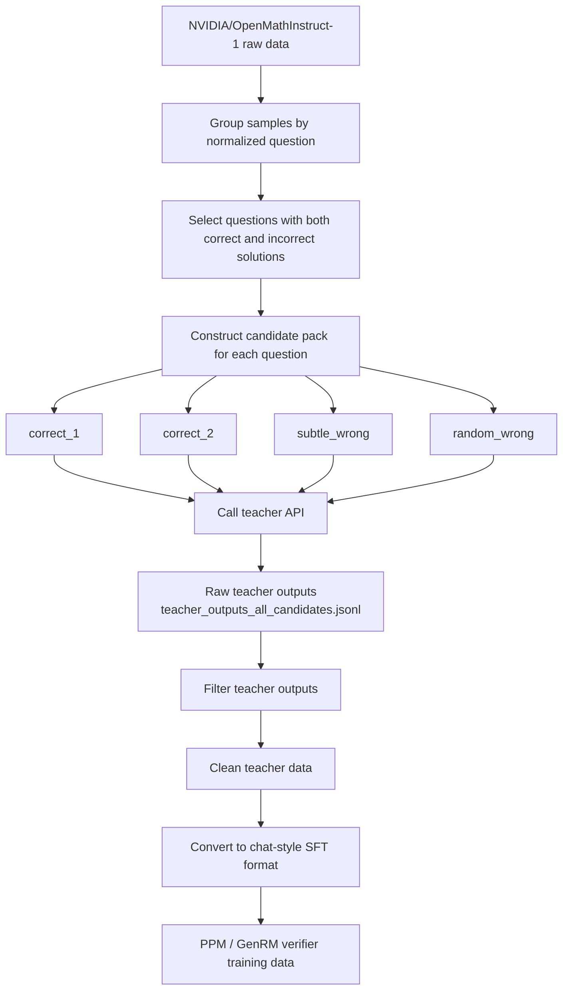

# Part 2.1 Candidate Teacher Data Pipeline

This repository contains the data-processing pipeline for building teacher-generated verification data for the EG-GenRM project.

The goal of this part is to turn public mathematical reasoning data into high-quality verifier training data. Starting from candidate solutions, we call a teacher model to generate step-by-step verification rationales, filter noisy teacher outputs, and convert the clean data into supervised fine-tuning format.

The final data can be used to train a PPM or a GenRM-style mathematical verifier.

---

## 1. What This Repository Does

This repository focuses on the data stage of the project.

The main workflow is:

```text
Raw candidate solutions
        ↓
Teacher rationale generation
        ↓
Raw teacher outputs
        ↓
Filtering and quality checking
        ↓
Clean teacher data
        ↓
SFT-format conversion
        ↓
PPM / verifier training data
```

The verifier training target is:

```text
Input:
Question + Candidate Solution

Output:
Step-by-step verification rationale + final Yes/No judgment
```

The final judgment must follow this format:

```text
Verification: Is the answer correct (Yes/No)? X
```

where `X` is either `Yes` or `No`.

---

## 2. Pipeline Flowchart

GitHub supports Mermaid diagrams. The following chart shows the full data pipeline.



A shorter version of the process is:

```text
NVIDIA/OpenMathInstruct-1 raw data
        ↓
Group by normalized question
        ↓
Select questions with both correct and incorrect solutions
        ↓
Construct 4 candidates per question
        ↓
correct_1 / correct_2 / subtle_wrong / random_wrong
        ↓
Call the teacher API
        ↓
Save raw outputs
        ↓
Filter and convert to SFT format
```

---

## 3. Repository Structure

```text
Part2.1_Candidate_Teacher_Menglei/
│
├── README.md
├── DATA.md
├── requirements.txt
│
├── configs/
│   └── data_config.yaml
│
├── prompts/
│   ├── teacher_verifier_prompt.txt
│   └── ppm_generation_prompt.txt
│
├── data/
│   └── examples/
│       ├── README.md
│       ├── teacher_output_sample.jsonl
│       ├── clean_teacher_sample.jsonl
│       ├── ppm_sft_sample.jsonl
│       ├── public_candidate_sample.jsonl
│       ├── ppm_generated_sample.jsonl
│       └── final_train_sample.jsonl
│
└── scripts/
    └── data/
        ├── README.md
        ├── 03_generate_teacher_rationales.py
        ├── 04_filter_teacher_outputs.py
        └── 05_build_ppm_sft_dataset.py
```

---

## 4. File and Folder Explanation

### `README.md`

This file is the main project introduction.

It explains:

- what this repository does;
- the full data pipeline;
- how to reproduce the data-processing steps;
- what each folder and file is used for.

---

### `DATA.md`

This file provides detailed documentation for the data.

It explains:

- where the data comes from;
- how candidate solutions are selected;
- how teacher data is generated;
- how raw teacher outputs are filtered;
- how clean data is converted into SFT format;
- how final training data is constructed.

Use `DATA.md` when you want to understand the data design in detail.

---

### `requirements.txt`

This file lists the Python packages needed to run the data-processing scripts.

Install the dependencies with:

```bash
pip install -r requirements.txt
```

Typical dependencies include:

```text
datasets
pandas
numpy
rapidfuzz
openai
python-dotenv
PyYAML
tqdm
jsonlines
```

---

### `configs/`

This folder stores configuration files.

#### `configs/data_config.yaml`

This file controls the main data-processing settings, such as:

- input file paths;
- output file paths;
- teacher model settings;
- API generation parameters;
- filtering rules;
- train/validation split ratio;
- checkpoint path.

Before running the scripts, check this file and update paths or parameters if needed.

Important parameters include:

```text
teacher_generation.input_file
teacher_generation.output_raw_file
teacher_generation.output_error_file
teacher_generation.checkpoint_file
teacher_generation.max_tokens
teacher_generation.temperature
teacher_generation.rate_limit_rpm
teacher_generation.max_retries
teacher_filter.min_rationale_chars
ppm_sft.valid_ratio
```

Different users may need different values depending on their API quota and compute environment.

---

### `prompts/`

This folder stores prompt templates.

#### `prompts/teacher_verifier_prompt.txt`

This prompt is used when calling the teacher model.

The teacher model receives a math question, a candidate solution, a reference solution, and the expected answer. It is asked to verify the candidate solution step by step and end with a final Yes/No judgment.

This prompt is used by:

```text
scripts/data/03_generate_teacher_rationales.py
```

#### `prompts/ppm_generation_prompt.txt`

This prompt is used later when a trained PPM generates teacher-like verification rationales for additional public data.

Unlike the teacher prompt, the PPM prompt usually only contains:

```text
Question
Candidate Solution
```

This is closer to the final verifier setting, where the model should judge the candidate solution without directly seeing the reference answer.

---

### `data/examples/`

This folder contains small sample data files.

These files are safe to upload to GitHub because they only contain a few examples. Full raw data and full processed data should not be committed.

#### `data/examples/README.md`

Explains what the example data files are.

#### `data/examples/teacher_output_sample.jsonl`

A small sample of raw teacher outputs.

This shows what the teacher model generated before filtering.

#### `data/examples/clean_teacher_sample.jsonl`

A small sample of teacher outputs after filtering.

These examples passed quality checks.

#### `data/examples/ppm_sft_sample.jsonl`

A small sample of chat-style SFT data for PPM training.

Each record contains:

```text
user message:
Question + Candidate Solution + instruction

assistant message:
Verification rationale + final Yes/No judgment
```

#### `data/examples/public_candidate_sample.jsonl`

A small sample of public-source candidate solutions.

These examples can later be completed with PPM-generated rationales.

#### `data/examples/ppm_generated_sample.jsonl`

A small sample of rationales generated by a trained PPM.

#### `data/examples/final_train_sample.jsonl`

A small sample of final verifier training examples after filtering, formatting, and fusion.

---

### `scripts/data/`

This folder contains the main data-processing code.

#### `scripts/data/README.md`

Explains the purpose of the scripts and how to run them.

#### `scripts/data/03_generate_teacher_rationales.py`

This script calls the teacher API.

Input:

```text
teacher seed data
teacher_verifier_prompt.txt
.env API settings
configs/data_config.yaml
```

Output:

```text
raw teacher output JSONL
error JSONL
checkpoint JSON
```

The raw output file is usually named:

```text
teacher_outputs_all_candidates.jsonl
```

This file is not directly used for training because it is still unfiltered.

#### `scripts/data/04_filter_teacher_outputs.py`

This script filters raw teacher outputs.

It checks:

- whether the API call succeeded;
- whether the final Yes/No verdict exists;
- whether the final verdict matches the original correctness label;
- whether the rationale is not empty or too short;
- whether wrong examples include useful error explanations when possible.

Output:

```text
clean_teacher_data.jsonl
clean_teacher_sample.jsonl
```

#### `scripts/data/05_build_ppm_sft_dataset.py`

This script converts clean teacher data into chat-style SFT format.

Output:

```text
ppm_sft_train.jsonl
ppm_sft_valid.jsonl
ppm_sft_sample.jsonl
```

This output can be used to train the PPM.

---

## 5. How to Reproduce

### Step 1: Clone the repository

```bash
git clone <your-repository-url>
cd Part2.1_Candidate_Teacher_Menglei
```

---

### Step 2: Install Python dependencies

```bash
pip install -r requirements.txt
```

If you use conda, you can also create a new environment first:

```bash
conda create -n eg-genrm python=3.10
conda activate eg-genrm
pip install -r requirements.txt
```

---

### Step 3: Prepare API credentials

The teacher-generation script requires an API key.

Create a local `.env` file in the project root:

```bash
NVIDIA_API_KEY=your_api_key_here
NVIDIA_API_BASE=https://integrate.api.nvidia.com/v1
TEACHER_MODEL=moonshotai/kimi-k2.5
```

Important:

Do not commit the real `.env` file to GitHub.

Your `.gitignore` should include:

```text
.env
```

If you use another OpenAI-compatible API provider, update the API base URL and model name.

---

### Step 4: Check the config file

Open:

```text
configs/data_config.yaml
```

Check the input and output paths.

You may need to update:

```text
input_file
output_raw_file
output_error_file
checkpoint_file
rate_limit_rpm
max_retries
timeout_s
max_tokens
temperature
```

These parameters depend on your own API quota.

For example, if your API limit is low, reduce:

```yaml
rate_limit_rpm: 20
```

If your teacher output is often incomplete, increase:

```yaml
max_tokens: 1024
```

---

### Step 5: Generate raw teacher rationales

Run:

```bash
python scripts/data/03_generate_teacher_rationales.py --config configs/data_config.yaml
```

This step sends each candidate solution to the teacher model.

The output is raw teacher-generated data.

This raw data may contain noise and should not be used directly for training.

---

### Step 6: Filter teacher outputs

Run:

```bash
python scripts/data/04_filter_teacher_outputs.py --config configs/data_config.yaml
```

This step removes invalid or low-quality teacher outputs.

It produces clean teacher data.

---

### Step 7: Convert clean data into SFT format

Run:

```bash
python scripts/data/05_build_ppm_sft_dataset.py --config configs/data_config.yaml
```

This step converts the clean teacher data into chat-style SFT format.

The output can be used for PPM training.

---

## 6. Input and Output Summary

| Step | Script | Input | Output |
|---|---|---|---|
| 1 | `03_generate_teacher_rationales.py` | teacher seed data | raw teacher outputs |
| 2 | `04_filter_teacher_outputs.py` | raw teacher outputs | clean teacher data |
| 3 | `05_build_ppm_sft_dataset.py` | clean teacher data | PPM SFT train/valid data |

---

## 7. Raw Data vs Final SFT Data

### Raw teacher data

The raw teacher output file stores unfiltered API outputs.

It may contain:

- API metadata;
- teacher prompt;
- raw teacher answer;
- parsed final verdict;
- retry count;
- token usage;
- timestamp;
- possible formatting problems.

Example:

```json
{
  "status": "ok",
  "question": "How many more digits does the base-3 representation of 987 have than the base-8 representation of 987?",
  "candidate_role": "subtle_wrong",
  "candidate_is_correct": false,
  "candidate_solution_clean": "We can easily do it in Python. First, we create a function to convert base-10 numbers to other bases. Then we compare the length difference.",
  "answer_text": "Step 1: The candidate describes a general base-conversion method.\nStep 2: However, the candidate does not actually compute the base-3 or base-8 representation.\nVerification: Is the answer correct (Yes/No)? No",
  "parsed_final_verdict": "No"
}
```

### SFT training data

The SFT file is cleaned and formatted for model training.

Example:

```json
{
  "messages": [
    {
      "role": "user",
      "content": "Question:\nHow many more digits does the base-3 representation of 987 have than the base-8 representation of 987?\n\nCandidate Solution:\nWe can easily do it in Python. First, we create a function to convert base-10 numbers to other bases. Then we compare the length difference.\n\nPlease verify the candidate solution step by step."
    },
    {
      "role": "assistant",
      "content": "Step 1: The candidate describes a general base-conversion method.\nStep 2: However, the candidate does not actually compute the base-3 or base-8 representation.\nStep 3: The candidate also does not provide the final numerical difference.\nVerification: Is the answer correct (Yes/No)? No"
    }
  ],
  "metadata": {
    "source": "teacher_generated",
    "candidate_role": "subtle_wrong",
    "gold_is_correct": false
  }
}
```

In short:

```text
Raw teacher data = original API output before filtering.
SFT data = clean, formatted, training-ready data.
```

---

## 8. Checkpoint and Resume

The teacher-generation script supports checkpointing.

The checkpoint file records which examples have already been processed.

If the script stops because of API limits, network errors, or manual interruption, run the same command again:

```bash
python scripts/data/03_generate_teacher_rationales.py --config configs/data_config.yaml
```

The script will skip completed examples and continue from the remaining examples.

This is useful because teacher generation may require many API calls.

---

## 9. Important Notes About API Limits

Each user must set API-related parameters based on their own API provider.

Important settings include:

```text
NVIDIA_API_KEY
NVIDIA_API_BASE
TEACHER_MODEL
rate_limit_rpm
max_retries
timeout_s
max_tokens
temperature
checkpoint_file
```

If the API returns too many rate-limit errors, lower `rate_limit_rpm`.

If the API response is often cut off, increase `max_tokens`.

If the API is unstable, increase `max_retries`.

Always keep checkpointing enabled for long runs.

---

## 10. What Should Be Uploaded to GitHub

Upload:

```text
README.md
DATA.md
requirements.txt
configs/data_config.yaml
prompts/*.txt
scripts/data/*.py
scripts/data/README.md
data/examples/*.jsonl
data/examples/README.md
```

Do not upload:

```text
.env
real API keys
full raw datasets
full teacher output files
full clean teacher data
full SFT training data
large checkpoints
model weights
```

Large data files should stay local or be stored in external storage.

Only small example files should be uploaded under:

```text
data/examples/
```

---

## 11. Summary

This repository builds teacher-generated verifier training data.

The main idea is:

```text
Use public candidate solutions
        ↓
Ask a teacher model to verify them
        ↓
Filter bad teacher outputs
        ↓
Convert clean examples into SFT format
        ↓
Train PPM or GenRM-style verifier
```

This structure makes the data pipeline clear, modular, and reproducible.
