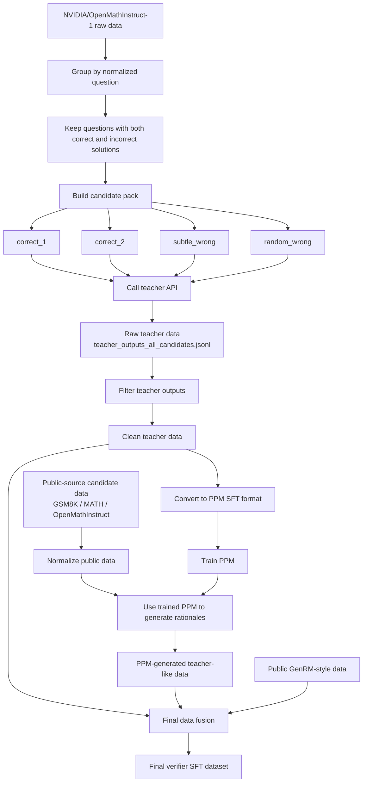

# Part 2.1 Candidate Teacher and PPM Data Pipeline

This repository contains the data construction pipeline for our EG-GenRM project.

The goal of this part is to build training data for a generative mathematical verifier. The verifier receives a math question and a candidate solution, then generates a step-by-step verification rationale and a final Yes/No judgment.

This repository focuses on the data stage, including teacher-data generation, filtering, PPM SFT data construction, public-data completion, final data merging, and SFT-format conversion.

---

## 1. Main Pipeline

Our data pipeline follows this order:

```text
NVIDIA/OpenMathInstruct-1 raw data
        ↓
Group samples by normalized question
        ↓
Select questions with both correct and incorrect solutions
        ↓
Construct candidate packs
        ↓
correct_1 / correct_2 / subtle_wrong / random_wrong
        ↓
Call teacher API
        ↓
Raw teacher data
        ↓
Filter teacher outputs
        ↓
Clean teacher data
        ↓
Convert clean teacher data into PPM SFT format
        ↓
Train PPM
        ↓
Use PPM to generate teacher-like rationales for public-source data
        ↓
Merge filtered teacher data + PPM-generated data + public GenRM-style data
        ↓
Final verifier SFT dataset
```

The final verifier training example has the following form:

```text
Input:
Question + Candidate Solution

Output:
Verification Rationale + Final Yes/No Judgment
```

The final judgment is always written as:

```text
Verification: Is the answer correct (Yes/No)? X
```

where `X` is either `Yes` or `No`.

---

## 2. Pipeline Flowchart



---

## 3. What Each Stage Does

### Stage 1: Build Teacher Candidate Data

We start from `NVIDIA/OpenMathInstruct-1`.

The raw dataset contains math questions and model-generated candidate solutions. Each record may include:

```text
question
generated_solution
expected_answer
predicted_answer
is_correct
```

We first group examples by normalized question. Then we keep questions that contain both correct and incorrect solutions. These questions are useful because they allow the verifier to learn the difference between valid and invalid reasoning for the same problem.

For each selected question, we construct four candidate solutions:

```text
correct_1
correct_2
subtle_wrong
random_wrong
```

The `subtle_wrong` candidate is especially important. It is an incorrect solution that looks similar to a correct solution but contains a hidden reasoning error.

---

### Stage 2: Generate Raw Teacher Data

For each candidate solution, we call a teacher model API.

The teacher receives:

```text
Question
Candidate Solution
Candidate Role
Reference Correct Solution
Expected Answer
```

The teacher is asked to verify the candidate solution step by step and produce a final Yes/No judgment.

The raw output is saved as:

```text
teacher_outputs_all_candidates.jsonl
```

This file is raw and unfiltered. It may contain formatting problems, missing verdicts, incomplete rationales, or inconsistent judgments.

---

### Stage 3: Filter Teacher Outputs

The raw teacher data is then filtered.

We keep examples only when:

```text
the API call succeeded
the final verdict is Yes or No
the final verdict matches the original correctness label
the rationale is not empty or too short
wrong solutions include a useful error explanation when possible
```

The output is clean teacher data.

This clean teacher data is the first high-quality supervision source in the project.

---

### Stage 4: Convert Clean Teacher Data into PPM SFT Format

Before training PPM, the clean teacher data is converted into chat-style SFT format.

Original clean teacher data stores fields separately:

```text
question
candidate_solution
verification_rationale
candidate_is_correct
final_verdict
source
```

The SFT version converts them into:

```json
{
  "messages": [
    {
      "role": "user",
      "content": "Question:\n...\n\nCandidate Solution:\n...\n\nPlease verify the candidate solution step by step."
    },
    {
      "role": "assistant",
      "content": "Step 1: ...\nStep 2: ...\nVerification: Is the answer correct (Yes/No)? No"
    }
  ],
  "metadata": {
    "source": "teacher_generated",
    "gold_is_correct": false
  }
}
```

This dataset is used to SFT the PPM.

---

### Stage 5: Train PPM

The PPM is trained on the clean teacher-generated rationales.

The purpose of PPM is to learn how to generate teacher-like verification rationales from:

```text
Question + Candidate Solution
```

After training, PPM can generate verification rationales for more public-source data at lower cost. This reduces the need to call the expensive teacher API for every public example.

---

### Stage 6: Use PPM to Complete Public Data

We also collect public-source math reasoning data, such as:

```text
GSM8K
MATH / MATH500
OpenMathInstruct-style candidate solutions
GenRM-style public examples
```

Many public examples have questions, candidate solutions, and labels, but they do not have detailed teacher-style verification rationales.

Therefore, we use the trained PPM to generate rationales for these public examples.

This produces PPM-generated teacher-like data:

```text
Question + Candidate Solution
        ↓
PPM
        ↓
Verification Rationale + Yes/No Judgment
```

---

### Stage 7: Final Data Fusion

Finally, we merge several data sources:

```text
1. Filtered teacher-generated data
2. PPM-generated teacher-like data
3. Public GenRM-style data
```

After merging, all examples are converted into one unified verifier SFT format.

This final dataset is used to train the GenRM / EG-GenRM verifier.

---

## 4. Repository Structure

```text
Part2.1_Candidate_Teacher_Menglei/
│
├── README.md
├── DATA.md
├── requirements.txt
│
├── configs/
│   └── data_config.yaml
│
├── prompts/
│   ├── teacher_verifier_prompt.txt
│   └── ppm_generation_prompt.txt
│
├── data/
│   └── examples/
│       ├── README.md
│       ├── teacher_output_sample.jsonl
│       ├── clean_teacher_sample.jsonl
│       ├── ppm_sft_sample.jsonl
│       ├── public_candidate_sample.jsonl
│       ├── ppm_generated_sample.jsonl
│       └── final_train_sample.jsonl
│
└── scripts/
    └── data/
        ├── README.md
        ├── 03_generate_teacher_rationales.py
        ├── 04_filter_teacher_outputs.py
        └── 05_build_ppm_sft_dataset.py
```

---

## 5. File Descriptions

### `DATA.md`

Detailed data documentation.

It explains the data sources, teacher-data generation, filtering, PPM SFT conversion, public-data completion, and final data fusion.

---

### `requirements.txt`

Python dependencies for the data-processing scripts.

Install them with:

```bash
pip install -r requirements.txt
```

---

### `configs/data_config.yaml`

Configuration file for the data pipeline.

It controls:

```text
input paths
output paths
teacher model parameters
API rate limit
checkpoint file
filtering rules
train/validation split
```

Users should update this file based on their own local paths and API quota.

---

### `prompts/teacher_verifier_prompt.txt`

Prompt used to call the teacher model.

This prompt can include the reference solution and expected answer, because teacher generation is used to create high-quality supervision data.

---

### `prompts/ppm_generation_prompt.txt`

Prompt used by the trained PPM to generate rationales for public-source examples.

This prompt usually only contains the question and candidate solution, which is closer to the final verifier setting.

---

### `data/examples/`

Small example files showing the data format at different stages.

Only small samples should be committed to GitHub. Full data files should not be uploaded.

---

### `scripts/data/03_generate_teacher_rationales.py`

Calls the teacher API and generates raw teacher rationales.

Input:

```text
teacher seed data
teacher prompt
API key from .env
configs/data_config.yaml
```

Output:

```text
teacher_outputs_all_candidates.jsonl
teacher_outputs_errors.jsonl
teacher_outputs_checkpoint.json
```

---

### `scripts/data/04_filter_teacher_outputs.py`

Filters raw teacher outputs.

Output:

```text
clean_teacher_data.jsonl
clean_teacher_sample.jsonl
```

---

### `scripts/data/05_build_ppm_sft_dataset.py`

Converts clean teacher data into PPM SFT format.

Output:

```text
ppm_sft_train.jsonl
ppm_sft_valid.jsonl
ppm_sft_sample.jsonl
```

---

## 6. How to Reproduce

### Step 1: Install dependencies

```bash
pip install -r requirements.txt
```

Or with conda:

```bash
conda create -n eg-genrm python=3.10
conda activate eg-genrm
pip install -r requirements.txt
```

---

### Step 2: Set API keys

Create a local `.env` file in the project root:

```bash
NVIDIA_API_KEY=your_api_key_here
NVIDIA_API_BASE=https://integrate.api.nvidia.com/v1
TEACHER_MODEL=moonshotai/kimi-k2.5
```

Do not upload the real `.env` file to GitHub.

API keys and model names must be set by each user.

---

### Step 3: Check configuration

Open:

```text
configs/data_config.yaml
```

Check and update:

```text
input_file
output_raw_file
output_error_file
checkpoint_file
rate_limit_rpm
max_retries
timeout_s
max_tokens
temperature
```

These values depend on your own API quota and environment.

If your API has a lower rate limit, reduce `rate_limit_rpm`.

If your run is interrupted, checkpointing allows the script to resume.

---

### Step 4: Generate teacher rationales

```bash
python scripts/data/03_generate_teacher_rationales.py --config configs/data_config.yaml
```

This produces raw teacher data.

---

### Step 5: Filter teacher outputs

```bash
python scripts/data/04_filter_teacher_outputs.py --config configs/data_config.yaml
```

This produces clean teacher data.

---

### Step 6: Build PPM SFT data

```bash
python scripts/data/05_build_ppm_sft_dataset.py --config configs/data_config.yaml
```

This produces PPM SFT train/validation data.

---

### Step 7: Train PPM and generate public rationales

After the PPM SFT data is built, train a PPM model using the generated SFT dataset.

Then use the trained PPM to generate verification rationales for public-source candidate data.

This part may be implemented in a later training script, but conceptually it follows:

```text
public candidate data
        ↓
trained PPM
        ↓
PPM-generated verification rationales
```

---

### Step 8: Merge final training data

Merge:

```text
clean teacher data
PPM-generated data
public GenRM-style data
```

Then convert all examples into final verifier SFT format.

The final dataset is used for GenRM / EG-GenRM verifier training.

---

## 7. Raw Teacher Data vs Final Training Data

### Raw teacher data

Raw teacher data is generated directly by the teacher API.

It may contain API metadata, prompt text, retry count, timestamp, token usage, and unfiltered teacher responses.

It is mainly used for inspection and filtering.

---

### Final training data

Final training data is cleaned, merged, and converted into SFT format.

It keeps only the fields needed for training:

```text
question
candidate solution
verification rationale
final Yes/No judgment
metadata
```

In short:

```text
Raw teacher data = unfiltered teacher API output.
Final SFT data = clean, merged, training-ready verifier data.
```

---

## 8. Important Notes

Each user must configure their own API key and API parameters.

Important parameters include:

```text
NVIDIA_API_KEY
NVIDIA_API_BASE
TEACHER_MODEL
rate_limit_rpm
max_retries
timeout_s
checkpoint_file
max_tokens
temperature
```

Do not upload:

```text
.env
real API keys
full raw datasets
full teacher outputs
full clean teacher data
full SFT training data
model checkpoints
```

Upload only:

```text
README.md
DATA.md
requirements.txt
configs/
prompts/
scripts/
data/examples/
```

---

## 9. Summary

This repository builds the data needed for a generative mathematical verifier.

The main contribution of this data stage is not only collecting public data. Instead, it builds a verifier-oriented training pipeline:

```text
Teacher data generation
        ↓
Teacher filtering
        ↓
PPM SFT construction
        ↓
PPM-based public data completion
        ↓
Final data fusion
        ↓
Verifier SFT training data
```

This makes the final verifier data cleaner, more explainable, and easier to reproduce.
