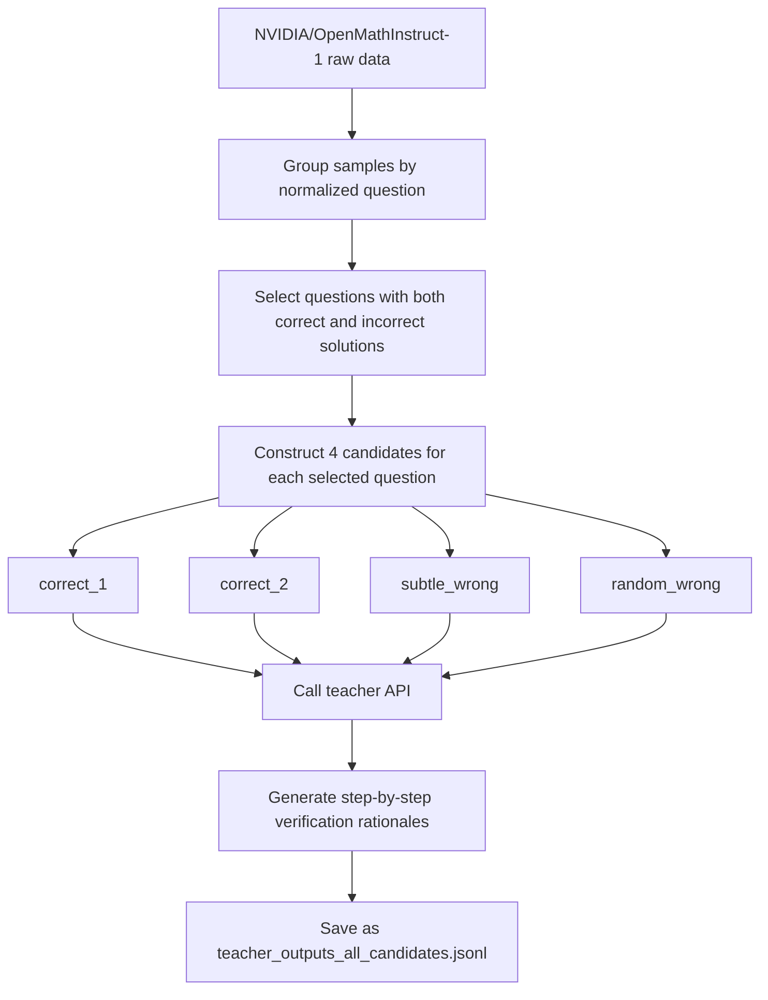

teacher_outputs_all_candidates (38).jsonl：

## Raw Teacher Data Before Filtering

The file `teacher_outputs_all_candidates.jsonl` stores the raw, unfiltered outputs generated by the teacher model.

This file is produced after we construct candidate solution packs from `NVIDIA/OpenMathInstruct-1` and call the teacher API for each candidate solution. At this stage, the data has not yet been cleaned or filtered. Therefore, it may still contain noisy examples, such as outputs with missing final verdicts, inconsistent Yes/No judgments, incomplete rationales, formatting problems, or API-related errors.

Each record corresponds to one math question and one candidate solution. The teacher model is asked to verify the candidate solution step by step and provide a final correctness judgment.

This raw file is not directly used for model training. It is first passed through a filtering step to produce a cleaner dataset for PPM supervised fine-tuning.

The filtering step checks whether:

- the API call succeeded;
- the teacher output contains a valid final Yes/No verdict;
- the teacher verdict matches the original correctness label;
- the verification rationale is not empty or too short;
- incorrect solutions include an explanation of the error when possible.

## Convert the Final Dataset into SFT Format

Before training, the filtered and merged dataset is converted into supervised fine-tuning, or SFT, format.

The original merged dataset stores each example with separate fields:

- `question`
- `candidate_solution`
- `expected_answer`
- `verification_rationale`
- `is_correct`
- `source`

However, most instruction-tuning pipelines expect the data to be in a chat-style format, where the model receives a user instruction and learns to generate the assistant response.

Therefore, before training, each example is converted into the following format:

Input:
`Question + Candidate Solution + Verification Instruction`

Target:
`Verification Rationale + Final Yes/No Judgment`

Example Raw Teacher Data Record
{
  "status": "ok",
  "run_id": "teacher_run_001",
  "row_id": "sample_000123",
  "question": "How many more digits does the base-3 representation of 987_10 have than the base-8 representation of 987_10?",
  "candidate_role": "subtle_wrong",
  "candidate_is_correct": false,
  "expected_answer": "3",
  "candidate_solution_clean": "We can easily do it in Python. First, we need to create a function that changes base-10 numbers to other bases. Then we get base-N and base-M representations and calculate their length difference.",
  "reference_solution_clean": "The base-3 representation of 987 has 7 digits, and the base-8 representation has 4 digits. Therefore, the difference is 7 - 4 = 3.",
  "teacher_model": "moonshotai/kimi-k2.5",
  "answer_text": "Step 1: The candidate proposes converting the number into different bases using Python.\nStep 2: However, the candidate does not actually compute the base-3 representation or the base-8 representation.\nStep 3: The candidate also does not provide the final numerical difference.\nEarliest Error: The solution describes a general method but never applies it to base 3 and base 8.\nVerification: Is the answer correct (Yes/No)? No",
  "parsed_final_verdict": "No",
  "earliest_error": "The solution describes a general method but never applies it to base 3 and base 8.",
  "retry_count": 0,
  "timestamp": "2026-05-09T00:00:00"
}

## Final Filtered and Merged Training Dataset

The file `merged_filtered_teacher_plus_genrm_sft.jsonl` is the final training dataset used for supervised fine-tuning of the generative verifier. Unlike the raw teacher output file, this dataset has already been filtered, cleaned, and merged from multiple data sources, including filtered teacher-generated rationales and GenRM-style public training examples.

Each record is converted into a unified verifier-training format. It contains a math question, a candidate solution, the expected answer, a verification rationale, a correctness label, and source metadata. This file is used directly for training the final GenRM / EG-GenRM verifier.
Example：
{
  "question": "Marcus can fit 5 pies in his oven at once. He bakes 7 batches of pies, then slips and drops 8 of them. How many pies are left?",
  "candidate_solution": "Let's think step by step.\nHe can fit 5 pies in the oven at once. He bakes 7 batches. This means he baked 5 * 7 = 35 pies. He dropped 8 of them. Therefore he is left with 35 - 8 = 27 pies. The answer is 27.",
  "expected_answer": "27",
  "verification_rationale": "**Step 1:**\nSolution: He can fit 5 pies in the oven at once. He bakes 7 batches. This means he baked 5 * 7 = 35 pies.\nExpected Answer: Marcus bakes 7 batches of pies and can fit 5 pies in his oven at once. This means he has baked 5 * 7 = 35 pies.\n\n**Verification:** The solution correctly calculates the number of pies Marcus baked.\n\n**Step 2:**\nSolution: He dropped 8 of them. Therefore he is left with 35 - 8 = 27 pies. The answer is 27.\nExpected Answer: If he drops 8 of them, he has 35 - 8 = 27 pies left. The answer is 27.\n\n**Final Grade:** Verification: Is the answer correct (Yes/No)? Yes",
  "is_correct": true,
  "source": "genrm_original_correct",
  "question_id": 3875,
  "model_output_id": 10
}

{
  "question": "Marcus can fit 5 pies in his oven at once. He bakes 7 batches of pies, then slips and drops 8 of them. How many pies are left?",
  "candidate_solution": "Let's think step by step. He can fit 5 pies in the oven at once. He bakes 7 batches. This means he baked 5 * 7 = 35 pies. He dropped 8 of them. Therefore he is left with 35 - 8 = 27 pies. The answer is 27.",
  "expected_answer": "27",
  "verification_rationale": "**Step 1:** The solution correctly calculates 5 * 7 = 35 pies. **Step 2:** The solution correctly subtracts 8 dropped pies, giving 35 - 8 = 27. Verification: Is the answer correct (Yes/No)? Yes",
  "is_correct": true,
  "source": "genrm_original_correct"
}
