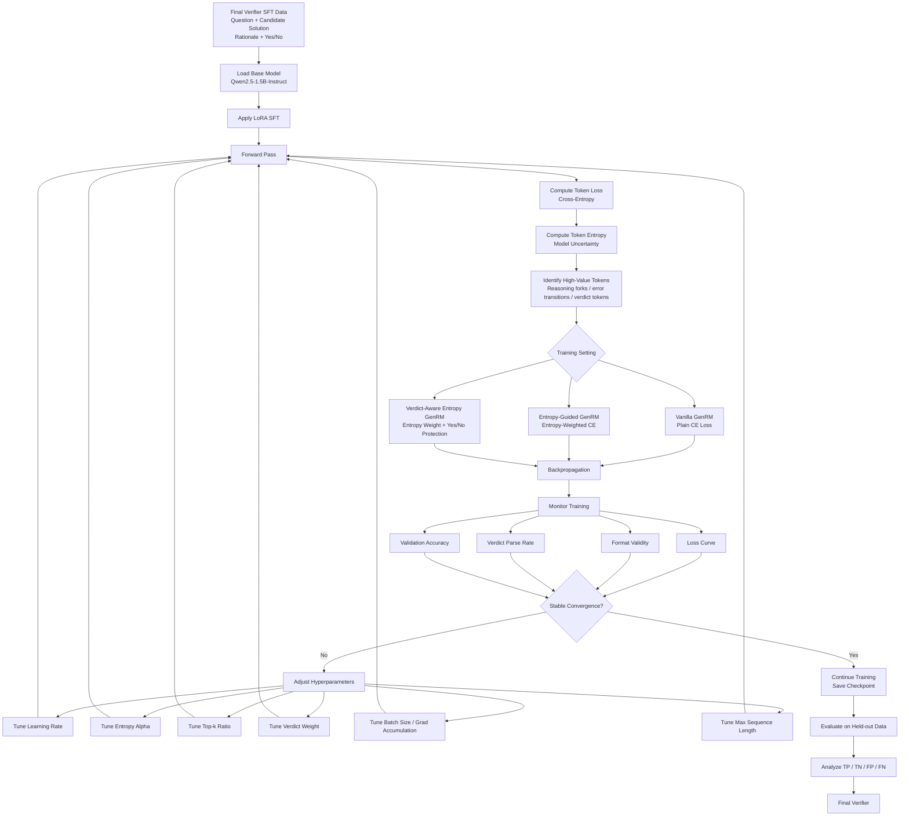

# Verifier Training README

This document explains the training pipeline for the EG-GenRM verifier.

The goal is to train a generative verifier that can read a math problem and a candidate solution, then generate a step-by-step verification rationale and a final Yes/No correctness judgment.
with using the loss guieded by the entropy.

---

## 1. Training Goal

The verifier learns the following mapping:

```text
Input:
Question + Candidate Solution

Output:
Verification Rationale + Final Yes/No Judgment
```

The final line must follow this exact format:

```text
Verification: Is the answer correct (Yes/No)? X
```

where `X` is either `Yes` or `No`.

This project does not train a simple classifier. Instead, it trains a generative verifier. The model must explain why a candidate solution is correct or incorrect before giving the final judgment.
So the output is really important.

---

## 2. Training Data

The training data comes from the data construction pipeline in Part 2.1.


Before training, all data should be converted into chat-style SFT format.

details see the chat_template.


## 3. Important Prompt Rule

The final verifier should only see:

```text
Question
Candidate Solution
```

It should not see the expected answer or reference solution during training.


Teacher data generation can use expected answers, but final verifier training should not.

---

## 4. Training Methods

After a fews try,
We train two main models.

### 4.1 Vanilla GenRM

Vanilla GenRM is the baseline.

It uses standard cross-entropy loss on all assistant tokens.


This model learns to generate verification rationales and final Yes/No judgments from the training data.

---

### 4.2 Entropy-Guided GenRM

Entropy-Guided GenRM uses an entropy-aware loss.

The idea is that some tokens are more important than others. Tokens with high predictive entropy often correspond to uncertain reasoning points, error transitions, or final judgment decisions.

This model gives higher training weight to uncertain tokens.

---

### 4.3 Verdict-Aware Entropy GenRM


It uses entropy-aware weighting but also protects the final Yes/No verdict tokens. This avoids a common failure mode where the model focuses on high-entropy reasoning tokens but loses the required final output format.


---


Train the models in this order:

```text
Step 1: Train Vanilla GenRM
Step 2: Train Entropy-Guided GenRM
Step 3: Train Verdict-Aware Entropy GenRM
Step 4: Evaluate all models on the same held-out validation/test set
```

This allows a fair comparison between the baseline and the entropy-guided method.

---


To test generalization, use a held-out evaluation file such as:

```text
openmath_val_verifier_eval.jsonl
```

This file should not be used during training.


After evaluation, analyze four types of cases:

```text
True Positive: gold Yes, model Yes
True Negative: gold No, model No
False Positive: gold No, model Yes
False Negative: gold Yes, model No
```

False positives are especially important because they show when the verifier is fooled by wrong but fluent reasoning.

---


### GPU Memory

If the model does not fit in memory, reduce:

```text
max_seq_length
per_device_train_batch_size
```

the average tokens of the data is about 3000, so a100 gpu is needed.

But you can try :

```yaml
max_seq_length: 2024
```

---


### Output Format

The model must end with:

```text
Verification: Is the answer correct (Yes/No)? X
```

If the model often misses this line, check:

```text
training data format
verifier_train_prompt.txt
whether verdict tokens are protected in entropy training
```

---

### Do Not Train on Bad Data

Before training, make sure the dataset has been filtered.

Bad examples include:

```text
missing final verdict
wrong Yes/No label
empty rationale
very short rationale
assistant output without verification reasoning
```

Low-quality training data can make the verifier unstable.

---


The training pipeline is:

```text
final verifier SFT data
        ↓
train Vanilla GenRM
        ↓
train Entropy-Guided GenRM
        ↓
train Verdict-Aware Entropy GenRM
        ↓
evaluate final Yes/No correctness
        ↓
analyze false positives and false negatives
```

The main comparison is:

```text
Vanilla GenRM:
plain cross-entropy on all assistant tokens

Entropy-Guided GenRM:
higher weight on uncertain reasoning tokens

Verdict-Aware Entropy GenRM:
entropy-guided training + protected Yes/No verdict tokens
```

The final goal is to build a verifier that can generalize to unseen math candidate solutions and reliably detect both correct reasoning and subtle wrong reasoning.
